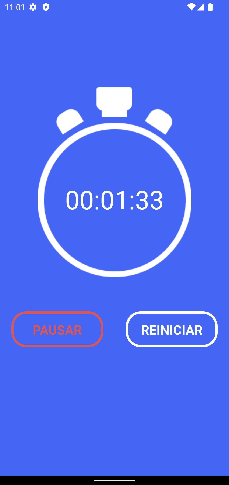

# Cronometro
:bulb: Portfolio Cronometro

# Objetivo

Tem a função de um cronômetro para administrar o tempo que leva para fazer algo ou alguma coisa. Pode ser usado em diversas finalidades, uma deles, pode ser usado na indústria pelas empresas. Controlar o tempo que uma máquina leva para fazer uma ação, e comparar essa atividade por uma semana ou mês, para ver se a máquina esta com um desempenho regular.

# React Native:

Imagens do aplicativo mobile: 
Clique na imagem para ampliar.

  
  
  
  

  

Clique no video abaixo para demonstração do aplicativo mobile com React Native:

  

# React JS:

Imagens do aplicativo web: 
Clique na imagem para ampliar.

  

  Web responsivo:

  

Clique no video abaixo para demonstração da aplicação web com React JS:

  

<!--  -->
